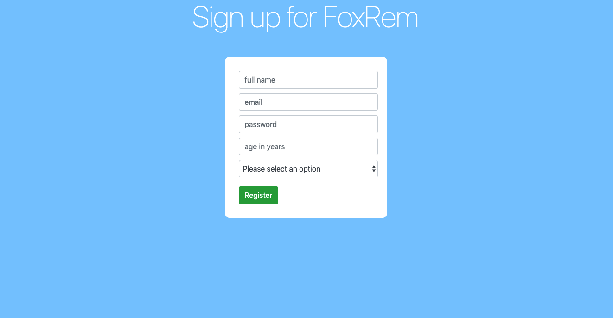

# Signup page template
> A simple web page teplate that provides signup form for user with validation fields ability.

It is easy and simple to build with, try to use it as a base template!

## Tools

> `html5`
> `css`
> `js`

## Usage example

Open `index.html` file in your browser.

## Meta

Volodymyr Yahello – vyahello@gmail.com

[https://github.com/vyahello](https://github.com/vyahello)

## Contributing

1. Fork it (https://github.com/vyahello/signup-page-template)
2. Create your feature branch (`git checkout -b feature/fooBar`)
3. Commit your changes (`git commit -am 'Add some fooBar'`)
4. Push to the branch (`git push origin feature/fooBar`)
5. Create a new Pull Request
